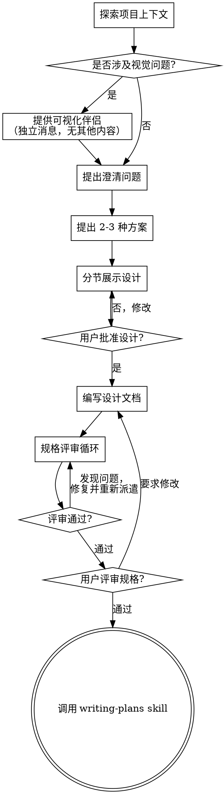

# 头脑风暴：从想法到设计

通过自然的协作对话，将想法转化为完整的设计和规格说明。

首先了解当前项目上下文，然后逐个提问来细化想法。一旦理解了要构建什么，就展示设计方案并获得用户批准。

<HARD-GATE>
在展示设计方案并获得用户批准之前，不得调用任何实现相关的 skill、编写任何代码、搭建任何项目骨架或采取任何实现行动。此规则适用于所有项目，无论看起来多简单。
</HARD-GATE>

## 反模式："这个太简单了，不需要设计"

每个项目都要经过这个流程。待办清单、单函数工具、配置变更——统统如此。"简单"项目恰恰是未经审视的假设造成最多返工的地方。设计可以很短（真正简单的项目几句话即可），但你必须展示并获得批准。

## 检查清单

你必须为以下每项创建任务，并按顺序完成：

1. **探索项目上下文** — 检查文件、文档、近期提交
2. **提供可视化伴侣**（如果主题涉及视觉问题）— 这条消息必须独立发送，不得与澄清问题合并。详见下方"可视化伴侣"章节。
3. **提出澄清问题** — 每次一个问题，理解目的/约束/成功标准
4. **提出 2-3 种方案** — 附带权衡分析和你的推荐
5. **展示设计** — 按复杂度分节展示，每节之后获取用户批准
6. **编写设计文档** — 保存到 `docs/specs/YYYY-MM-DD-<topic>-design.md` 并提交
7. **规格评审循环** — 派遣 spec-document-reviewer 子代理进行精确的评审（不传递会话历史）；修复问题后重新派遣直到通过（最多 3 次迭代，之后交给用户处理）
8. **用户评审已编写的规格** — 请用户在继续之前评审规格文件
9. **过渡到实现** — 调用 writing-plans skill 创建实现计划

## 流程图

**终态是调用 writing-plans。** 不得调用 frontend-design、mcp-builder 或任何其他实现 skill。头脑风暴之后唯一要调用的 skill 就是 writing-plans。

## 流程详解

**理解想法：**

- 首先检查当前项目状态（文件、文档、近期提交）
- 在问详细问题之前先评估范围：如果需求描述了多个独立子系统（例如"构建一个包含聊天、文件存储、计费和分析的平台"），立即标记。不要花时间细化一个需要先拆解的项目。
- 如果项目太大，无法用单个规格说明覆盖，帮助用户拆解为子项目：有哪些独立部分、它们如何关联、应该按什么顺序构建？然后按正常设计流程对第一个子项目进行头脑风暴。每个子项目都有自己的 规格 → 计划 → 实现 循环。
- 对于范围合适的项目，逐个提问来细化想法
- 尽可能使用选择题，开放式问题也可以
- 每条消息只问一个问题——如果某个主题需要更多探索，拆成多个问题
- 聚焦理解：目的、约束、成功标准

**探索方案：**

- 提出 2-3 种不同方案及权衡分析
- 以对话方式展示选项，附带你的推荐和理由
- 先说推荐方案，解释原因

**展示设计：**

- 一旦你认为理解了要构建什么，就展示设计
- 每个部分的篇幅与其复杂度成正比：简单的几句话，复杂的可达 200-300 词
- 每节之后询问目前看起来是否正确
- 涵盖：架构、组件、数据流、错误处理、测试
- 随时准备回头澄清不清楚的地方

**为隔离性和清晰性而设计：**

- 将系统拆分为更小的单元，每个单元职责单一、通过定义良好的接口通信、可独立理解和测试
- 对于每个单元，你应该能回答：它做什么、怎么用、依赖什么？
- 能否不读内部实现就理解一个单元的功能？能否修改内部实现而不破坏消费方？如果不能，边界需要调整。
- 更小、边界清晰的单元对你来说也更容易处理——你对能一次性放入上下文的代码推理更准确，当文件职责聚焦时编辑也更可靠。当文件变大时，这通常是它职责过多的信号。

**在已有代码库中工作：**

- 在提出变更之前先探索现有结构。遵循已有模式。
- 当已有代码存在影响当前工作的问题时（例如文件过大、边界不清、职责纠缠），将针对性改进纳入设计——就像一个好的开发者改进他正在工作的代码一样。
- 不要提议无关的重构。专注于服务当前目标。

## 设计之后

**文档：**

- 将验证过的设计（规格）写入 `docs/specs/YYYY-MM-DD-<topic>-design.md`
  - （用户对规格位置的偏好优先于此默认值）
- 如果可用，使用 elements-of-style:writing-clearly-and-concisely skill
- 将设计文档提交到 git

**规格评审循环：**
编写规格文档之后：

1. 派遣 spec-document-reviewer 子代理（见 spec-document-reviewer-prompt.md）
2. 如果发现问题：修复、重新派遣，重复直到通过
3. 如果循环超过 3 次迭代，交给用户处理

**用户评审关卡：**
规格评审循环通过后，请用户在继续之前评审已编写的规格：

> "规格已编写并提交到 `<path>`。请评审一下，如果需要修改请告诉我，然后我们再开始编写实现计划。"

等待用户回复。如果用户要求修改，修改后重新运行规格评审循环。只有用户批准后才能继续。

**实现：**

- 调用 writing-plans skill 创建详细的实现计划
- 不要调用任何其他 skill。writing-plans 是下一步。

## 关键原则

- **每次一个问题** — 不要用多个问题轰炸用户
- **优先选择题** — 在可能的情况下比开放式问题更容易回答
- **严格执行 YAGNI** — 从所有设计中移除不必要的功能
- **探索替代方案** — 在确定之前始终提出 2-3 种方案
- **增量验证** — 展示设计，获得批准后再继续
- **保持灵活** — 有不清楚的地方就回头澄清

## 可视化伴侣

基于浏览器的伴侣工具，用于在头脑风暴过程中展示模型图、图表和视觉选项。它是一个工具——不是一种模式。接受伴侣意味着它可用于受益于视觉展示的问题；并不意味着每个问题都要通过浏览器。

**提供伴侣：** 当你预期接下来的问题涉及视觉内容（模型图、布局、图表），征求一次同意：

> "我们要讨论的一些内容，用浏览器展示可能更直观。我可以在讨论过程中制作模型图、图表、对比图和其他可视化内容。这个功能还比较新，可能会消耗较多 token。要试试吗？（需要打开一个本地 URL）"

**此提议必须作为独立消息发送。** 不要与澄清问题、上下文总结或任何其他内容合并。消息中应仅包含上述提议，不含其他内容。等待用户回复后再继续。如果用户拒绝，以纯文本模式继续头脑风暴。

**逐个问题决策：** 即使用户接受了伴侣，仍需对每个问题单独决定是使用浏览器还是终端。判断标准：**用户看到它是否比读到它更容易理解？**

- **使用浏览器** 展示本身就是视觉性的内容——模型图、线框图、布局对比、架构图、并排视觉设计
- **使用终端** 展示文本内容——需求问题、概念选择、权衡清单、A/B/C/D 文本选项、范围决策

关于 UI 主题的问题不一定是视觉问题。"在这个上下文中 personality 是什么意思？"是概念问题——用终端。"哪个向导布局更好？"是视觉问题——用浏览器。

如果用户同意使用伴侣，在继续之前阅读详细指南：
`skills/brainstorming/visual-companion.md`
