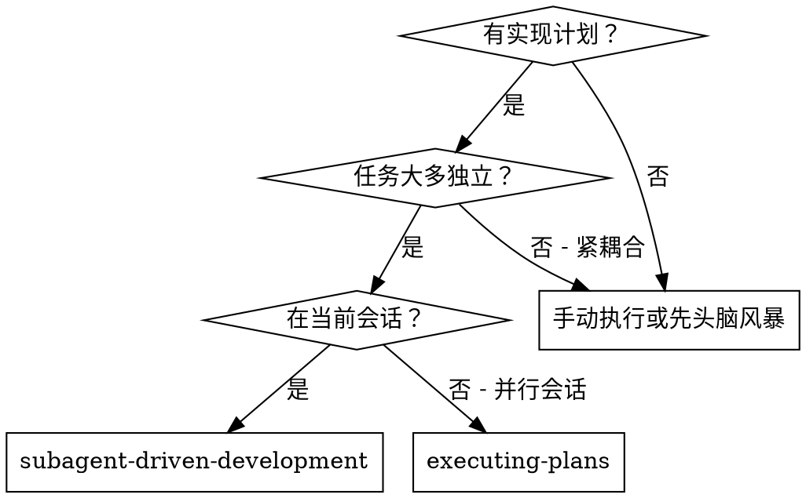
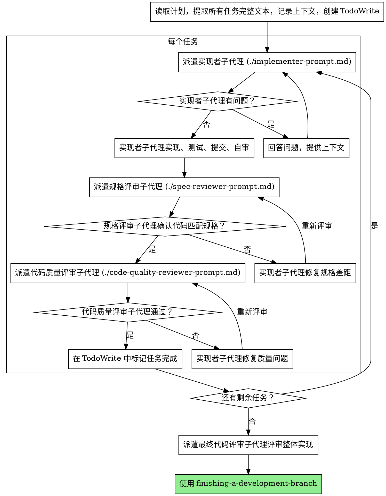

# 子代理驱动开发

<HARD-GATE>
在派遣任何实现子代理之前，必须确认当前在 worktree 独立分支上工作（非 main/master）。
如果不在 worktree 中，必须先调用 using-git-worktrees skill 创建隔离工作空间。
禁止在 main/master 分支上直接执行实现计划。
</HARD-GATE>

通过为每个任务派遣全新子代理来执行计划，每个任务完成后进行两阶段评审：先规格合规评审，再代码质量评审。

**为什么用子代理：** 你将任务委派给具有隔离上下文的专业代理。通过精心构造它们的指令和上下文，确保它们保持专注并完成任务。它们不应继承你的会话上下文或历史——你精确构造它们所需的一切。这也保留了你自己的上下文用于协调工作。

**核心原则：** 每任务全新子代理 + 两阶段评审（规格 → 质量）= 高质量、快速迭代

## 何时使用



**对比 Executing Plans（并行会话）：**

- 同一会话（无上下文切换）
- 每任务全新子代理（无上下文污染）
- 每个任务后两阶段评审：先规格合规，再代码质量
- 更快迭代（任务之间无需人工介入）

## 流程



## 模型选择

使用能胜任每个角色的最低功耗模型，以节约成本和提高速度。

**机械性实现任务**（独立函数、明确规格、1-2 个文件）：使用快速、便宜的模型。当计划规格完善时，大多数实现任务都是机械性的。

**集成和判断任务**（多文件协调、模式匹配、调试）：使用标准模型。

**架构、设计和评审任务**：使用最强的可用模型。

**任务复杂度信号：**

- 涉及 1-2 个文件且规格完整 → 便宜模型
- 涉及多个文件且有集成问题 → 标准模型
- 需要设计判断或广泛的代码库理解 → 最强模型

## 处理实现者状态

实现者子代理报告四种状态之一。按各自方式处理：

**DONE：** 进入规格合规评审。

**DONE_WITH_CONCERNS：** 实现者完成了工作但标记了疑虑。继续之前阅读这些疑虑。如果疑虑关于正确性或范围，在评审前处理。如果是观察性的（例如"这个文件越来越大了"），记录下来并继续评审。

**NEEDS_CONTEXT：** 实现者需要未提供的信息。提供缺失的上下文并重新派遣。

**BLOCKED：** 实现者无法完成任务。评估阻塞原因：

1. 如果是上下文问题，提供更多上下文并用同一模型重新派遣
2. 如果任务需要更多推理能力，用更强的模型重新派遣
3. 如果任务太大，拆分为更小的部分
4. 如果计划本身有误，上报给用户

**绝不**忽略上报或在不做改变的情况下强制同一模型重试。如果实现者说它卡住了，就有什么需要改变。

## 提示词模板

- `./implementer-prompt.md` — 派遣实现者子代理
- `./spec-reviewer-prompt.md` — 派遣规格合规评审子代理
- `./code-quality-reviewer-prompt.md` — 派遣代码质量评审子代理

## 工作流示例

```
你：我正在使用子代理驱动开发来执行这个计划。

[读取计划文件：docs/plans/feature-plan.md]
[提取所有 5 个任务的完整文本和上下文]
[创建包含所有任务的 TodoWrite]

任务 1：Hook 安装脚本

[获取任务 1 文本和上下文（已提取）]
[派遣实现子代理，附带完整任务文本 + 上下文]

实现者："开始之前——hook 应该安装在用户级别还是系统级别？"

你："用户级别（~/.config/agent/hooks/）"

实现者："明白了。开始实现..."
[稍后] 实现者：
  - 实现了 install-hook 命令
  - 添加了测试，5/5 通过
  - 自审：发现遗漏了 --force 参数，已添加
  - 已提交

[派遣规格合规评审]
规格评审：✅ 规格合规 - 所有要求已满足，没有多余内容

[获取 git SHA，派遣代码质量评审]
代码评审：优点：测试覆盖好，代码简洁。问题：无。通过。

[标记任务 1 完成]

任务 2：恢复模式

[获取任务 2 文本和上下文（已提取）]
[派遣实现子代理，附带完整任务文本 + 上下文]

实现者：[没有问题，直接开始]
实现者：
  - 添加了验证/修复模式
  - 8/8 测试通过
  - 自审：一切正常
  - 已提交

[派遣规格合规评审]
规格评审：❌ 问题：
  - 缺失：进度报告（规格要求"每 100 项报告一次"）
  - 多余：添加了 --json 参数（未请求）

[实现者修复问题]
实现者：移除了 --json 参数，添加了进度报告

[规格评审再次评审]
规格评审：✅ 现在规格合规

[派遣代码质量评审]
代码评审：优点：扎实。问题（重要）：魔法数字（100）

[实现者修复]
实现者：提取了 PROGRESS_INTERVAL 常量

[代码评审再次评审]
代码评审：✅ 通过

[标记任务 2 完成]

...

[所有任务完成后]
[派遣最终代码评审]
最终评审：所有要求已满足，可以合并

完成！
```

## 优势

**对比手动执行：**

- 子代理天然遵循 TDD
- 每任务全新上下文（不会混乱）
- 并行安全（子代理互不干扰）
- 子代理可以提问（工作前和工作中都可以）

**对比 Executing Plans：**

- 同一会话（无交接）
- 持续推进（无需等待）
- 评审检查点自动化

**效率提升：**

- 无文件读取开销（控制器提供完整文本）
- 控制器精确策划所需上下文
- 子代理预先获得完整信息
- 问题在工作开始前（而非之后）浮现

**质量关卡：**

- 自审在交接前捕获问题
- 两阶段评审：规格合规，然后代码质量
- 评审循环确保修复确实有效
- 规格合规防止过度/不足构建
- 代码质量确保实现质量良好

**成本：**

- 更多子代理调用（每任务 1 个实现者 + 2 个评审者）
- 控制器需要更多准备工作（预先提取所有任务）
- 评审循环增加迭代次数
- 但能尽早捕获问题（比后期调试更划算）

## 红线

**绝不要：**

- 未经用户明确同意就在 main/master 分支上开始实现
- 跳过评审（规格合规或代码质量）
- 在问题未修复的情况下继续
- 并行派遣多个实现子代理（会冲突）
- 让子代理读取计划文件（应提供完整文本）
- 跳过场景设定上下文（子代理需要理解任务的位置）
- 忽略子代理的问题（在它们继续之前回答）
- 在规格合规上接受"差不多就行"（规格评审发现问题 = 未完成）
- 跳过评审循环（评审发现问题 = 实现者修复 = 再次评审）
- 让实现者的自审取代正式评审（两者都需要）
- **在规格合规通过 ✅ 之前开始代码质量评审**（顺序错误）
- 在任一评审有未解决问题时进入下一个任务

**如果子代理提问：**

- 清楚完整地回答
- 如有需要提供额外上下文
- 不要催促它们进入实现

**如果评审者发现问题：**

- 实现者（同一子代理）修复
- 评审者再次评审
- 重复直到通过
- 不要跳过再次评审

**如果子代理无法完成任务：**

- 派遣修复子代理并附带具体指令
- 不要尝试手动修复（上下文污染）

## 集成

**必需的工作流 skill：**

- **using-git-worktrees** — 必须：开始前搭建隔离工作空间
- **writing-plans** — 创建此 skill 执行的计划
- **requesting-code-review** — 评审子代理使用的代码评审模板
- **finishing-a-development-branch** — 所有任务完成后收尾开发工作

**子代理应使用：**

- **test-driven-development** — 子代理对每个任务遵循 TDD

**替代工作流：**

- **executing-plans** — 用于并行会话而非同会话执行
