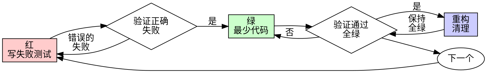

# 测试驱动开发（TDD）

## 概述

先写测试。看它失败。写最少代码使它通过。

**核心原则：** 如果你没有看到测试失败，你就不知道它是否测了正确的东西。

**违反规则的字面意思就是违反规则的精神。**

## 何时使用

**始终：**

- 新功能
- Bug 修复
- 重构
- 行为变更

**例外（需用户同意）：**

- 一次性原型
- 生成的代码
- 配置文件

想着"就这一次跳过 TDD"？停下来。那是合理化借口。

## 铁律

```
没有先写失败测试，不写生产代码
```

先写了代码再写测试？删掉它。重新开始。

**没有例外：**

- 不要保留它作为"参考"
- 不要在写测试时"改编"它
- 不要看它
- 删掉就是删掉

从测试出发重新实现。句号。

## 红-绿-重构



### 红 - 写失败测试

写一个最小测试，展示应该发生什么。

<Good>
```typescript
test('retries failed operations 3 times', async () => {
  let attempts = 0;
  const operation = () => {
    attempts++;
    if (attempts < 3) throw new Error('fail');
    return 'success';
  };

const result = await retryOperation(operation);

expect(result).toBe('success');
expect(attempts).toBe(3);
});

````
名称清晰，测试真实行为，只测一件事
</Good>

<Bad>
```typescript
test('retry works', async () => {
  const mock = jest.fn()
    .mockRejectedValueOnce(new Error())
    .mockRejectedValueOnce(new Error())
    .mockResolvedValueOnce('success');
  await retryOperation(mock);
  expect(mock).toHaveBeenCalledTimes(3);
});
````

名称模糊，测的是 mock 而非代码
</Bad>

**要求：**

- 一个行为
- 清晰的名称
- 真实代码（除非不可避免，否则不用 mock）

### 验证红 - 看它失败

**必须执行。绝不跳过。**

```bash
npm test path/to/test.test.ts
```

确认：

- 测试失败（不是报错）
- 失败信息符合预期
- 因为功能缺失而失败（不是拼写错误）

**测试通过了？** 你在测试已有行为。修改测试。

**测试报错了？** 修复错误，重新运行直到它正确失败。

### 绿 - 最少代码

写最简单的代码使测试通过。

<Good>
```typescript
async function retryOperation<T>(fn: () => Promise<T>): Promise<T> {
  for (let i = 0; i < 3; i++) {
    try {
      return await fn();
    } catch (e) {
      if (i === 2) throw e;
    }
  }
  throw new Error('unreachable');
}
```
刚好够通过
</Good>

<Bad>
```typescript
async function retryOperation<T>(
  fn: () => Promise<T>,
  options?: {
    maxRetries?: number;
    backoff?: 'linear' | 'exponential';
    onRetry?: (attempt: number) => void;
  }
): Promise<T> {
  // YAGNI
}
```
过度设计
</Bad>

不要添加功能、重构其他代码或超出测试范围"改进"。

### 验证绿 - 看它通过

**必须执行。**

```bash
npm test path/to/test.test.ts
```

确认：

- 测试通过
- 其他测试仍然通过
- 输出干净（无错误、无警告）

**测试失败了？** 修改代码，不是修改测试。

**其他测试失败了？** 立即修复。

### 重构 - 清理

仅在全绿之后：

- 移除重复
- 改进命名
- 提取辅助函数

保持测试全绿。不要添加行为。

### 重复

为下一个功能写下一个失败测试。

## 好的测试

| 质量         | 好                             | 差                                                  |
| ------------ | ------------------------------ | --------------------------------------------------- |
| **最小**     | 只测一件事。名称有"和"？拆分。 | `test('validates email and domain and whitespace')` |
| **清晰**     | 名称描述行为                   | `test('test1')`                                     |
| **展示意图** | 展示期望的 API                 | 模糊代码应该做什么                                  |

## 为什么顺序重要

**"我先写完代码再写测试验证"**

先写代码再写的测试会立即通过。立即通过什么都不证明：

- 可能测错了东西
- 可能测的是实现而非行为
- 可能遗漏了你忘记的边界情况
- 你从没看到它捕获 bug

先写测试迫使你看到测试失败，证明它确实在测试某些东西。

**"我已经手动测试了所有边界情况"**

手动测试是临时的。你以为测试了所有情况但是：

- 没有测试了什么的记录
- 代码变更时无法重新运行
- 压力下容易遗忘情况
- "我试过是好的" ≠ 全面覆盖

自动化测试是系统性的。它们每次以相同方式运行。

**"删掉 X 小时的工作太浪费了"**

沉没成本谬误。时间已经过去了。你现在的选择是：

- 删掉并用 TDD 重写（再花 X 小时，高置信度）
- 保留并后补测试（30 分钟，低置信度，可能有 bug）

"浪费"是保留你无法信任的代码。没有真实测试的可工作代码是技术债务。

**"TDD 太教条了，务实意味着灵活变通"**

TDD 就是务实的：

- 在提交前发现 bug（比之后调试更快）
- 防止回归（测试立即捕获破坏）
- 记录行为（测试展示如何使用代码）
- 支持重构（自由修改，测试捕获破坏）

"务实"的捷径 = 在生产中调试 = 更慢。

**"后写测试也能达到同样目的——重要的是精神不是仪式"**

不。后写测试回答"这做了什么？"先写测试回答"这应该做什么？"

后写测试被你的实现偏见影响。你测试的是你构建的东西，而非需求。你验证的是记住的边界情况，而非发现的。

先写测试迫使在实现之前发现边界情况。后写测试验证你记住了所有情况（你没有）。

30 分钟的后补测试 ≠ TDD。你得到了覆盖率，但失去了测试有效的证明。

## 常见合理化借口

| 借口                       | 现实                                          |
| -------------------------- | --------------------------------------------- |
| "太简单不需要测试"         | 简单代码也会出错。测试只要 30 秒。            |
| "我之后再写测试"           | 立即通过的测试什么都不证明。                  |
| "后写测试也能达到同样目的" | 后写 = "这做了什么？" 先写 = "这应该做什么？" |
| "已经手动测试过了"         | 临时 ≠ 系统化。没有记录，无法重跑。           |
| "删掉 X 小时的工作太浪费"  | 沉没成本谬误。保留未验证的代码才是技术债务。  |
| "保留作为参考，先写测试"   | 你会改编它。那就是后写测试。删掉就是删掉。    |
| "需要先探索一下"           | 可以。扔掉探索结果，从 TDD 开始。             |
| "测试很难写 = 设计不明确"  | 听测试的话。难以测试 = 难以使用。             |
| "TDD 会拖慢我"             | TDD 比调试快。务实 = 先写测试。               |
| "手动测试更快"             | 手动不能证明边界情况。每次变更都要重测。      |
| "现有代码没有测试"         | 你在改进它。为现有代码补测试。                |

## 红旗 — 停下来重新开始

- 先写代码再写测试
- 实现之后才写测试
- 测试立即通过
- 无法解释测试为什么失败
- 测试"以后"再补
- 合理化"就这一次"
- "我已经手动测试过了"
- "后写测试也能达到同样目的"
- "重要的是精神不是仪式"
- "保留作为参考"或"改编现有代码"
- "已经花了 X 小时，删掉太浪费"
- "TDD 太教条了，我在务实"
- "这个情况不同因为..."

**以上所有都意味着：删掉代码。用 TDD 重新开始。**

## 示例：Bug 修复

**Bug：** 空邮箱被接受

**红**

```typescript
test('rejects empty email', async () => {
  const result = await submitForm({ email: '' });
  expect(result.error).toBe('Email required');
});
```

**验证红**

```bash
$ npm test
FAIL: expected 'Email required', got undefined
```

**绿**

```typescript
function submitForm(data: FormData) {
  if (!data.email?.trim()) {
    return { error: 'Email required' };
  }
  // ...
}
```

**验证绿**

```bash
$ npm test
PASS
```

**重构**
如果需要，提取验证函数用于多个字段。

## 验证清单

在标记工作完成之前：

- [ ] 每个新函数/方法都有测试
- [ ] 看到了每个测试在实现之前失败
- [ ] 每个测试因为预期原因失败（功能缺失，非拼写错误）
- [ ] 为每个测试写了最少代码使其通过
- [ ] 所有测试通过
- [ ] 输出干净（无错误、无警告）
- [ ] 测试使用真实代码（仅在不可避免时使用 mock）
- [ ] 覆盖了边界情况和错误情况

不能勾选所有项？你跳过了 TDD。重新开始。

## 卡住时

| 问题               | 解决方案                           |
| ------------------ | ---------------------------------- |
| 不知道怎么测试     | 写期望的 API。先写断言。问用户。   |
| 测试太复杂         | 设计太复杂。简化接口。             |
| 必须 mock 所有东西 | 代码耦合太紧。使用依赖注入。       |
| 测试 setup 太大    | 提取辅助函数。还是复杂？简化设计。 |

## 调试集成

发现 bug？写一个失败测试复现它。遵循 TDD 循环。测试证明修复有效并防止回归。

不写测试就不修 bug。

## 测试反模式

添加 mock 或测试工具时，阅读 @testing-anti-patterns.md 避免常见陷阱：

- 测试 mock 行为而非真实行为
- 在生产类中添加仅测试用的方法
- 不理解依赖就使用 mock

## 最终规则

```
生产代码 → 测试存在且先失败了
否则 → 不是 TDD
```

没有用户的许可不得例外。
