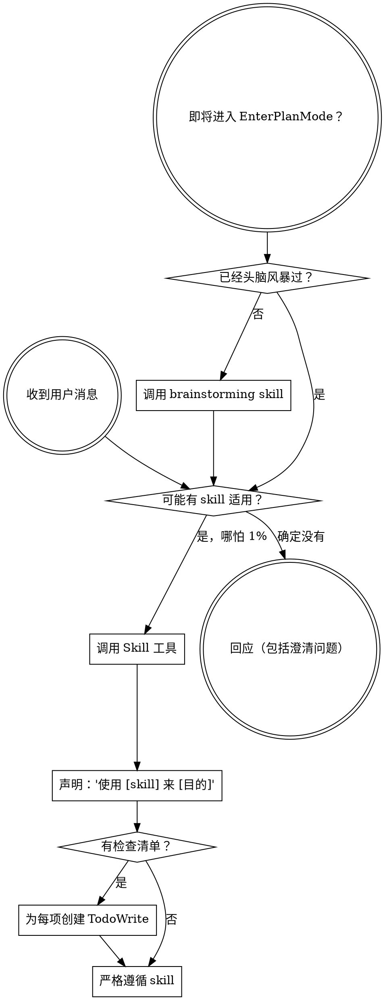

<SUBAGENT-STOP>
如果你是作为子代理被派遣来执行特定任务的，跳过此 skill。
</SUBAGENT-STOP>

<EXTREMELY-IMPORTANT>
如果你认为哪怕只有 1% 的可能性某个 skill 适用于你正在做的事情，你绝对必须调用该 skill。

如果一个 skill 适用于你的任务，你没有选择。你必须使用它。

这不可协商。这不是可选的。你不能为自己找借口绕过这个。
</EXTREMELY-IMPORTANT>

## 指令优先级

Skill 覆盖默认系统提示行为，但**用户指令始终优先**：

1. **用户的明确指令**（CLAUDE.md、GEMINI.md、AGENTS.md、直接请求）— 最高优先级
2. **Skill** — 在冲突处覆盖默认系统行为
3. **默认系统提示** — 最低优先级

如果 CLAUDE.md、GEMINI.md 或 AGENTS.md 说"不使用 TDD"而某个 skill 说"始终使用 TDD"，遵循用户的指令。用户掌控一切。

## 如何访问 Skill

**在 Claude Code 中：** 使用 `Skill` 工具。当你调用一个 skill 时，其内容会被加载并展示给你——直接遵循即可。不要使用 Read 工具读取 skill 文件。

**在 Gemini CLI 中：** Skill 通过 `activate_skill` 工具激活。Gemini 在会话开始时加载 skill 元数据，按需激活完整内容。

**在其他环境中：** 查阅你的平台文档了解 skill 如何加载。

## 平台适配

Skill 使用 Claude Code 工具名称。非 CC 平台：参见 `references/codex-tools.md`（Codex）了解工具映射。Gemini CLI 用户通过 GEMINI.md 自动加载工具映射。

# 使用 Skill

## 规则

**在任何响应或行动之前调用相关或被请求的 skill。** 即使只有 1% 的可能性某个 skill 适用，你也应该调用它来检查。如果调用后发现 skill 不适合当前情况，你不需要使用它。

**触发确认：** 在回复的开头用一行简短声明确认本 skill 已触发，格式：`[using-skills] 已检查 skill 列表 → 调用: <skill 名称>` 或 `[using-skills] 已检查 skill 列表 → 无匹配`。

## 红旗

这些想法意味着停下来——你在合理化借口：

| 想法                      | 现实                                       |
| ------------------------- | ------------------------------------------ |
| "这只是个简单问题"        | 问题就是任务。检查 skill。                 |
| "我需要先了解更多上下文"  | Skill 检查在澄清问题之前。                 |
| "让我先探索代码库"        | Skill 告诉你如何探索。先检查。             |
| "我可以快速看看 git/文件" | 文件缺乏对话上下文。检查 skill。           |
| "让我先收集信息"          | Skill 告诉你如何收集信息。                 |
| "这不需要正式的 skill"    | 如果 skill 存在，就使用它。                |
| "我记得这个 skill"        | Skill 会演进。读当前版本。                 |
| "这不算一个任务"          | 行动 = 任务。检查 skill。                  |
| "这个 skill 太重了"       | 简单的事情会变复杂。用它。                 |
| "我先做这一件事"          | 做任何事之前先检查。                       |
| "这感觉很高效"            | 无纪律的行动浪费时间。Skill 防止这种情况。 |
| "我知道那是什么意思"      | 知道概念 ≠ 使用 skill。调用它。            |

## Skill 优先级

当多个 skill 可能适用时，使用此顺序：

1. **流程 skill 优先**（头脑风暴、调试）— 它们决定如何处理任务
2. **实现 skill 其次**（前端设计、MCP 构建器）— 它们指导执行

"让我们构建 X" → 先头脑风暴，再用实现 skill。
"修复这个 bug" → 先调试，再用领域特定 skill。

## Skill 类型

**刚性的**（TDD、调试）：严格遵循。不要为了灵活而放弃纪律。

**柔性的**（模式）：根据上下文调整原则。

Skill 本身会告诉你它是哪种。

## 用户指令

指令说的是做什么，不是怎么做。"添加 X"或"修复 Y"不意味着跳过工作流。
