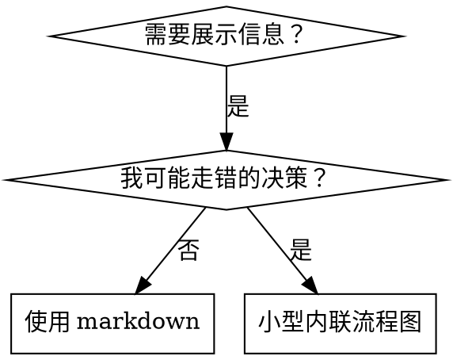

# 编写 Skill

## 概述

**编写 skill 就是将测试驱动开发应用于流程文档。**

**个人 skill 放在代理特定目录中（Claude Code 用 `~/.cursor/skills`，Codex 用 `~/.agents/skills/`）**

你编写测试用例（用子代理的压力场景），看它们失败（基线行为），编写 skill（文档），看测试通过（代理遵守），然后重构（封堵漏洞）。

**核心原则：** 如果你没有看到代理在没有 skill 的情况下失败，你就不知道 skill 是否教了正确的东西。

**必备背景：** 使用此 skill 前你必须理解 test-driven-development。那个 skill 定义了基本的红-绿-重构循环。此 skill 将 TDD 适配到文档。

**官方指南：** 关于 Anthropic 官方 skill 编写最佳实践，参见 anthropic-best-practices.md。该文档提供了补充此 skill 中 TDD 方法的额外模式和指南。

## 什么是 Skill？

**Skill** 是经过验证的技术、模式或工具的参考指南。Skill 帮助未来的 Claude 实例找到并应用有效的方法。

**Skill 是：** 可复用的技术、模式、工具、参考指南

**Skill 不是：** 关于你某次如何解决问题的叙事

## TDD 与 Skill 的映射

| TDD 概念           | Skill 创建                           |
| ------------------ | ------------------------------------ |
| **测试用例**       | 用子代理的压力场景                   |
| **生产代码**       | Skill 文档（SKILL.md）               |
| **测试失败（红）** | 代理在没有 skill 时违反规则（基线）  |
| **测试通过（绿）** | 代理在有 skill 时遵守                |
| **重构**           | 封堵漏洞同时保持合规                 |
| **先写测试**       | 在编写 skill 之前运行基线场景        |
| **看它失败**       | 记录代理使用的确切合理化借口         |
| **最少代码**       | 编写针对那些具体违规的 skill         |
| **看它通过**       | 验证代理现在遵守了                   |
| **重构循环**       | 找到新的合理化借口 → 封堵 → 重新验证 |

整个 skill 创建过程遵循红-绿-重构。

## 何时创建 Skill

**创建条件：**

- 技术对你来说不是直觉上显而易见的
- 你会跨项目再次引用它
- 模式广泛适用（非项目特定）
- 其他人会受益

**不要为以下情况创建：**

- 一次性解决方案
- 其他地方有充分文档的标准实践
- 项目特定的惯例（放在 CLAUDE.md 中）
- 机械性约束（如果可以用正则/验证自动化，就自动化——将文档留给需要判断的情况）

## Skill 类型

### 技术型

具有步骤的具体方法（condition-based-waiting、root-cause-tracing）

### 模式型

思考问题的方式（flatten-with-flags、test-invariants）

### 参考型

API 文档、语法指南、工具文档（office docs）

## 目录结构

```
skills/
  skill-name/
    SKILL.md              # 主参考文件（必需）
    supporting-file.*     # 仅在需要时
```

**扁平命名空间** — 所有 skill 在一个可搜索的命名空间中

**分离文件的条件：**

1. **重度参考**（100+ 行）— API 文档、综合语法
2. **可复用工具** — 脚本、工具、模板

**保持内联：**

- 原则和概念
- 代码模式（< 50 行）
- 其他所有内容

## SKILL.md 结构

**Frontmatter（YAML）：**

- 仅支持两个字段：`name` 和 `description`
- 总计最多 1024 字符
- `name`：仅使用字母、数字和连字符（无括号、特殊字符）
- `description`：第三人称，仅描述何时使用（不描述它做什么）
  - 以"Use when..."开头聚焦于触发条件
  - 包含具体的症状、情况和上下文
  - **绝不概括 skill 的流程或工作流**（原因见 CSO 章节）
  - 尽可能保持在 500 字符以内

```markdown
---
name: Skill-Name-With-Hyphens
description: Use when [specific triggering conditions and symptoms]
---

# Skill 名称

## 概述

这是什么？核心原则用 1-2 句话。

## 何时使用

[如果决策不明显，小型内联流程图]

症状和用例的项目符号列表
何时不使用

## 核心模式（技术型/模式型）

前后代码对比

## 快速参考

表格或项目符号，便于扫描常见操作

## 实现

简单模式内联代码
重度参考或可复用工具链接到文件

## 常见错误

什么会出错 + 修复

## 真实世界影响（可选）

具体结果
```

## Claude 搜索优化（CSO）

**对发现至关重要：** 未来的 Claude 需要找到你的 skill

### 1. 丰富的 Description 字段

**目的：** Claude 读取 description 来决定为给定任务加载哪些 skill。让它回答："我现在应该读这个 skill 吗？"

**格式：** 以"Use when..."开头聚焦于触发条件

**关键：Description = 何时使用，不是 Skill 做什么**

Description 应仅描述触发条件。不要在 description 中概括 skill 的流程或工作流。

**为什么重要：** 测试发现当 description 概括了 skill 的工作流时，Claude 可能会遵循 description 而不是阅读完整的 skill 内容。一个说"任务之间进行代码评审"的 description 导致 Claude 只做了一次评审，即使 skill 的流程图清楚显示了两次评审（先规格合规再代码质量）。

当 description 改为仅"Use when executing implementation plans with independent tasks"（无工作流概述）时，Claude 正确读取了流程图并遵循了两阶段评审流程。

**陷阱：** 概括工作流的 description 创建了 Claude 会走的捷径。Skill 正文变成了 Claude 跳过的文档。

```yaml
# ❌ 差：概括了工作流 — Claude 可能遵循此处而非读 skill
description: Use when executing plans - dispatches subagent per task with code review between tasks

# ❌ 差：太多流程细节
description: Use for TDD - write test first, watch it fail, write minimal code, refactor

# ✅ 好：仅触发条件，无工作流概述
description: Use when executing implementation plans with independent tasks in the current session

# ✅ 好：仅触发条件
description: Use when implementing any feature or bugfix, before writing implementation code
```

**内容：**

- 使用具体的触发器、症状和信号此 skill 适用的情况
- 描述问题（竞态条件、不一致行为）而非语言特定症状（setTimeout、sleep）
- 保持触发器技术无关，除非 skill 本身是技术特定的
- 如果 skill 是技术特定的，在触发器中明确说明
- 用第三人称书写（注入到系统提示中）
- **绝不概括 skill 的流程或工作流**

```yaml
# ❌ 差：太抽象、含糊、不包含何时使用
description: For async testing

# ❌ 差：第一人称
description: I can help you with async tests when they're flaky

# ❌ 差：提到了技术但 skill 并非特定于它
description: Use when tests use setTimeout/sleep and are flaky

# ✅ 好：以"Use when"开头，描述问题，无工作流
description: Use when tests have race conditions, timing dependencies, or pass/fail inconsistently

# ✅ 好：技术特定 skill 有明确触发器
description: Use when using React Router and handling authentication redirects
```

### 2. 关键词覆盖

使用 Claude 会搜索的词：

- 错误信息："Hook timed out"、"ENOTEMPTY"、"race condition"
- 症状："flaky"、"hanging"、"zombie"、"pollution"
- 同义词："timeout/hang/freeze"、"cleanup/teardown/afterEach"
- 工具：实际命令、库名、文件类型

### 3. 描述性命名

**使用主动语态，动词优先：**

- ✅ `creating-skills` 而非 `skill-creation`
- ✅ `condition-based-waiting` 而非 `async-test-helpers`

### 4. Token 效率（关键）

**问题：** getting-started 和高频引用的 skill 会加载到每次对话中。每个 token 都很重要。

**目标词数：**

- getting-started 工作流：每个 <150 词
- 高频加载 skill：总计 <200 词
- 其他 skill：<500 词（仍要简洁）

**技巧：**

**将细节移到工具帮助中：**

```bash
# ❌ 差：在 SKILL.md 中记录所有参数
search-conversations supports --text, --both, --after DATE, --before DATE, --limit N

# ✅ 好：引用 --help
search-conversations supports multiple modes and filters. Run --help for details.
```

**使用交叉引用：**

```markdown
# ❌ 差：重复工作流细节

When searching, dispatch subagent with template...
[20 lines of repeated instructions]

# ✅ 好：引用其他 skill

Always use subagents (50-100x context savings). REQUIRED: Use [other-skill-name] for workflow.
```

**压缩示例：**

```markdown
# ❌ 差：冗长示例（42 词）

your human partner: "How did we handle authentication errors in React Router before?"
You: I'll search past conversations for React Router authentication patterns.
[Dispatch subagent with search query: "React Router authentication error handling 401"]

# ✅ 好：最小示例（20 词）

Partner: "How did we handle auth errors in React Router?"
You: Searching...
[Dispatch subagent → synthesis]
```

**消除冗余：**

- 不要重复交叉引用 skill 中的内容
- 不要解释命令本身已经很明显的内容
- 不要包含同一模式的多个示例

**验证：**

```bash
wc -w skills/path/SKILL.md
# getting-started 工作流：目标 <150 词
# 其他高频加载：目标总计 <200 词
```

**按你做什么或核心洞察命名：**

- ✅ `condition-based-waiting` > `async-test-helpers`
- ✅ `using-skills` 而非 `skill-usage`
- ✅ `flatten-with-flags` > `data-structure-refactoring`
- ✅ `root-cause-tracing` > `debugging-techniques`

**动名词（-ing）适合流程：**

- `creating-skills`、`testing-skills`、`debugging-with-logs`
- 主动的，描述你正在采取的行动

### 4. 交叉引用其他 Skill

**编写引用其他 skill 的文档时：**

仅使用 skill 名称，附带明确的需求标记：

- ✅ 好：`**REQUIRED SUB-SKILL:** Use test-driven-development`
- ✅ 好：`**REQUIRED BACKGROUND:** You MUST understand systematic-debugging`
- ❌ 差：`See skills/testing/test-driven-development`（不清楚是否必需）
- ❌ 差：`@skills/testing/test-driven-development/SKILL.md`（强制加载，消耗上下文）

**为什么不用 @ 链接：** `@` 语法立即强制加载文件，在你需要之前就消耗了 200k+ 上下文。

## 流程图使用



**仅在以下情况使用流程图：**

- 不明显的决策点
- 你可能过早停止的流程循环
- "何时用 A vs B"的决策

**绝不用流程图展示：**

- 参考资料 → 表格、列表
- 代码示例 → Markdown 代码块
- 线性指令 → 编号列表
- 无语义含义的标签（step1、helper2）

参见 @graphviz-conventions.dot 了解 graphviz 样式规则。

**为用户可视化：** 使用本目录下的 `render-graphs.js` 将 skill 的流程图渲染为 SVG：

```bash
./render-graphs.js ../some-skill           # 每个图表单独渲染
./render-graphs.js ../some-skill --combine # 所有图表合并为一个 SVG
```

## 代码示例

**一个优秀示例胜过多个平庸的**

选择最相关的语言：

- 测试技术 → TypeScript/JavaScript
- 系统调试 → Shell/Python
- 数据处理 → Python

**好的示例：**

- 完整且可运行
- 注释良好，解释为什么
- 来自真实场景
- 清晰展示模式
- 可以直接适配（非通用模板）

**不要：**

- 用 5+ 种语言实现
- 创建填空模板
- 编写人为的示例

你擅长移植——一个优秀示例就够了。

## 文件组织

### 自包含 Skill

```
defense-in-depth/
  SKILL.md    # 所有内容内联
```

适用情况：所有内容都合适，无需重度参考

### 带可复用工具的 Skill

```
condition-based-waiting/
  SKILL.md    # 概述 + 模式
  example.ts  # 可适配的可工作辅助函数
```

适用情况：工具是可复用代码，不仅仅是叙事

### 带重度参考的 Skill

```
pptx/
  SKILL.md       # 概述 + 工作流
  pptxgenjs.md   # 600 行 API 参考
  ooxml.md       # 500 行 XML 结构
  scripts/       # 可执行工具
```

适用情况：参考材料太大无法内联

## 铁律（与 TDD 相同）

```
没有先写失败测试，不写 Skill
```

这适用于新 skill 和对现有 skill 的编辑。

先写 skill 再测试？删掉它。重新开始。
编辑 skill 不测试？同样违规。

**没有例外：**

- 不适用于"简单添加"
- 不适用于"只是添加一个章节"
- 不适用于"文档更新"
- 不要保留未测试的变更作为"参考"
- 不要在运行测试时"改编"
- 删掉就是删掉

**必备背景：** test-driven-development skill 解释了为什么这很重要。同样的原则适用于文档。

## 测试所有 Skill 类型

不同 skill 类型需要不同的测试方法：

### 纪律执行型 Skill（规则/要求）

**示例：** TDD、verification-before-completion、designing-before-coding

**测试方式：**

- 学术问题：它们是否理解规则？
- 压力场景：压力下是否遵守？
- 多重压力组合：时间 + 沉没成本 + 疲惫
- 识别合理化借口并添加明确的反驳

**成功标准：** 代理在最大压力下遵循规则

### 技术型 Skill（操作指南）

**示例：** condition-based-waiting、root-cause-tracing、defensive-programming

**测试方式：**

- 应用场景：能否正确应用技术？
- 变体场景：能否处理边界情况？
- 信息缺失测试：指令是否有缺口？

**成功标准：** 代理成功将技术应用于新场景

### 模式型 Skill（心智模型）

**示例：** reducing-complexity、information-hiding 概念

**测试方式：**

- 识别场景：能否识别何时适用？
- 应用场景：能否使用心智模型？
- 反例：知道何时不适用吗？

**成功标准：** 代理正确识别何时/如何应用模式

### 参考型 Skill（文档/API）

**示例：** API 文档、命令参考、库指南

**测试方式：**

- 检索场景：能否找到正确信息？
- 应用场景：能否正确使用找到的信息？
- 缺口测试：是否覆盖了常见用例？

**成功标准：** 代理找到并正确应用参考信息

## 跳过测试的常见合理化借口

| 借口               | 现实                                                     |
| ------------------ | -------------------------------------------------------- |
| "Skill 显然很清晰" | 对你清晰 ≠ 对其他代理清晰。测试它。                      |
| "这只是参考"       | 参考可能有缺口、不清晰的章节。测试检索。                 |
| "测试太过了"       | 未测试的 skill 都有问题。始终如此。15 分钟测试省数小时。 |
| "出了问题再测"     | 问题 = 代理无法使用 skill。部署前测试。                  |
| "测试太繁琐"       | 测试比在生产中调试有问题的 skill 更不繁琐。              |
| "我有信心它很好"   | 过度自信保证有问题。无论如何测试。                       |
| "学术审查就够了"   | 阅读 ≠ 使用。测试应用场景。                              |
| "没时间测试"       | 部署未测试的 skill 后修复它浪费更多时间。                |

**以上所有都意味着：部署前测试。没有例外。**

## 防止合理化的 Skill 加固

执行纪律的 skill（如 TDD）需要抵抗合理化。代理很聪明，在压力下会找到漏洞。

**心理学注释：** 理解说服技术为什么有效可以帮助你系统地应用它们。参见 persuasion-principles.md 了解研究基础（Cialdini, 2021; Meincke et al., 2025）关于权威、承诺、稀缺性、社会证明和统一性原则。

### 明确封堵每个漏洞

不要只陈述规则——禁止具体的变通方法：

<Bad>
```markdown
先写代码再写测试？删掉它。
```
</Bad>

<Good>
```markdown
先写代码再写测试？删掉它。重新开始。

**没有例外：**

- 不要保留它作为"参考"
- 不要在写测试时"改编"它
- 不要看它
- 删掉就是删掉

````
</Good>

### 应对"精神 vs 字面"的论证

尽早添加基础原则：

```markdown
**违反规则的字面意思就是违反规则的精神。**
````

这切断了整类"我在遵循精神"的合理化借口。

### 构建合理化借口表

从基线测试中捕获合理化借口（见下方测试章节）。代理提出的每个借口都进入表格：

```markdown
| 借口                       | 现实                                          |
| -------------------------- | --------------------------------------------- |
| "太简单不需要测试"         | 简单代码也会出错。测试只要 30 秒。            |
| "我之后再写测试"           | 立即通过的测试什么都不证明。                  |
| "后写测试也能达到同样目的" | 后写 = "这做了什么？" 先写 = "这应该做什么？" |
```

### 创建红旗列表

让代理在合理化时容易自检：

```markdown
## 红旗 — 停下来重新开始

- 先写代码再写测试
- "我已经手动测试过了"
- "后写测试也能达到同样目的"
- "重要的是精神不是仪式"
- "这个情况不同因为..."

**以上所有都意味着：删掉代码。用 TDD 重新开始。**
```

### 更新 CSO 以包含违规症状

在 description 中添加：你即将违反规则时的症状：

```yaml
description: use when implementing any feature or bugfix, before writing implementation code
```

## Skill 的红-绿-重构

遵循 TDD 循环：

### 红：写失败测试（基线）

在没有 skill 的情况下用子代理运行压力场景。记录确切行为：

- 它们做了什么选择？
- 使用了什么合理化借口（逐字记录）？
- 哪些压力触发了违规？

这是"看测试失败"——你必须在编写 skill 之前看到代理自然地做什么。

### 绿：写最少 Skill

编写针对那些具体合理化借口的 skill。不要为假设情况添加额外内容。

用 skill 运行同样的场景。代理现在应该遵守。

### 重构：封堵漏洞

代理找到新的合理化借口？添加明确的反驳。重新测试直到无懈可击。

**测试方法论：** 参见 @testing-skills-with-subagents.md 了解完整的测试方法论：

- 如何编写压力场景
- 压力类型（时间、沉没成本、权威、疲惫）
- 系统地封堵漏洞
- 元测试技术

## 反模式

### ❌ 叙事示例

"在 2025-10-03 的会话中，我们发现空 projectDir 导致了..."
**为什么差：** 太具体，不可复用

### ❌ 多语言稀释

example-js.js、example-py.py、example-go.go
**为什么差：** 质量平庸，维护负担

### ❌ 流程图中的代码

```dot
step1 [label="import fs"];
step2 [label="read file"];
```

**为什么差：** 无法复制粘贴，难以阅读

### ❌ 通用标签

helper1、helper2、step3、pattern4
**为什么差：** 标签应有语义含义

## 停：进入下一个 Skill 之前

**编写任何 skill 之后，你必须停下来完成部署流程。**

**不要：**

- 批量创建多个 skill 而不逐个测试
- 在当前 skill 验证之前进入下一个
- 因为"批量更高效"就跳过测试

**下方部署清单对每个 skill 都是强制性的。**

部署未测试的 skill = 部署未测试的代码。这违反了质量标准。

## Skill 创建清单（TDD 适配）

**重要：使用 TodoWrite 为下方每个清单项创建 todo。**

**红阶段 — 写失败测试：**

- [ ] 创建压力场景（纪律型 skill 需 3+ 种组合压力）
- [ ] 在没有 skill 的情况下运行场景——逐字记录基线行为
- [ ] 识别合理化借口中的模式

**绿阶段 — 写最少 Skill：**

- [ ] 名称仅使用字母、数字、连字符（无括号/特殊字符）
- [ ] YAML frontmatter 仅有 name 和 description（最多 1024 字符）
- [ ] Description 以"Use when..."开头并包含具体触发器/症状
- [ ] Description 用第三人称书写
- [ ] 全文关键词覆盖用于搜索（错误、症状、工具）
- [ ] 清晰的概述附带核心原则
- [ ] 针对红阶段识别的具体基线失败
- [ ] 代码内联或链接到单独文件
- [ ] 一个优秀示例（非多语言）
- [ ] 用 skill 运行场景——验证代理现在遵守

**重构阶段 — 封堵漏洞：**

- [ ] 从测试中识别新的合理化借口
- [ ] 为每个漏洞添加明确反驳（纪律型 skill）
- [ ] 从所有测试迭代构建合理化借口表
- [ ] 创建红旗列表
- [ ] 重新测试直到无懈可击

**质量检查：**

- [ ] 仅在决策不明显时使用小流程图
- [ ] 快速参考表
- [ ] 常见错误章节
- [ ] 无叙事性叙述
- [ ] 辅助文件仅用于工具或重度参考

**部署：**

- [ ] 提交 skill 到 git 并推送到你的 fork（如果已配置）
- [ ] 考虑通过 PR 回馈（如果广泛有用）

## 发现工作流

未来的 Claude 如何找到你的 skill：

1. **遇到问题**（"测试不稳定"）
2. **找到 SKILL**（description 匹配）
3. **扫描概述**（这相关吗？）
4. **阅读模式**（快速参考表）
5. **加载示例**（仅在实现时）

**为此流程优化** — 尽早并经常放置可搜索的术语。

## 底线

**创建 skill 就是流程文档的 TDD。**

同样的铁律：没有先写失败测试，不写 skill。
同样的循环：红（基线）→ 绿（写 skill）→ 重构（封堵漏洞）。
同样的好处：更好的质量、更少的意外、无懈可击的结果。

如果你对代码遵循 TDD，对 skill 也要遵循。这是同样的纪律应用于文档。
